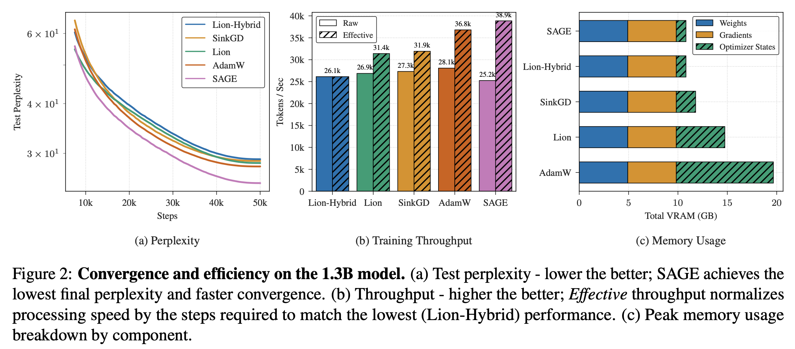

# SAGE: Sign-Adaptive Gradient for Memory-Efficient LLM Optimization

[](https://arxiv.org/abs/2604.07663)
[](https://opensource.org/licenses/MIT)
[](https://www.python.org/downloads/)

> **Official Implementation** for the paper: *"SAGE: Sign-Adaptive Gradient for Memory-Efficient LLM Optimization"*

## 📢 News
- **[Apr 6 2026]** SAGE has been accepted to **ACL Findings 2026**! 🎉
- **[Apr 9 2026]** Initial release of the SAGE optimizer and training scripts. Preprint is available on [arXiv](https://arxiv.org/abs/2604.07663).

## Overview

**SAGE** is a novel optimizer designed to optimize Large Language Models (LLMs) with high memory efficiency. By leveraging sign-adaptive gradient estimation and hybrid strategies—combining Sinkhorn iterations for 2D layers and Sign regulated-opt for embeddings—SAGE achieves competitive convergence rates with significantly lower memory overhead compared to standard optimizers.



## Repository Structure

- **`src/optimizers/`**: Core optimizer implementations.
  - `sage_universal.py`: The main SAGE optimizer (supporting hybrid and pure modes).
  - `sage_universal_opt.py`: An optimized implementation (`UniSAGEOptimized`) using `torch._foreach` operations for minimal CPU overhead. *(Note: Not yet tested at scale for performance.)*
- **`src/callbacks.py`**: Custom Trainer callbacks for monitoring memory usage, perplexity, and directional sharpness.
- **`scripts/`**: Utilities for data downloading and experiment orchestration.
- **`train.py`**: The main training entry point using Hugging Face `Trainer`.

## Setup 

Ensure you have Python 3.9+ installed along with the necessary dependencies. We recommend using `uv` for fast environment management:

```bash
uv venv --python 3.12
source .venv/bin/activate
uv pip install -r requirements.txt
```

## Quick Start

### 1. Data Preparation

Download a sample dataset (e.g., a subset of the Pile) for sanity checking:
```bash
python scripts/download_sample_data.py
```

Tokenize and preprocess the data:
```bash
python preprocess.py \
    --dataset_path ./mini_pile_subset \
    --processed_output_path ./processed_dataset \
    --tokenizer_name llama
```
*> Note: Replace `llama` with your specific model tokenizer path.*

### 2. Training

Launch a training run using `train.py`. Below is an example using the **SAGE** optimizer:

```bash
python train.py \
    --model_name_or_path llama \
    --dataset_path ./processed_dataset \
    --optimizer SAGE \
    --output_dir ./outputs/sage_run \
    --learning_rate 2e-3 \
    --per_device_train_batch_size 8 \
    --max_steps 1000
```

### 3. Running Experiments

To reproduce the experiments from the paper (sweeping across LLaMA model sizes and optimizers):
```bash
bash scripts/run_experiments.sh
```

## Supported Optimizers

This repository supports several optimizers for comprehensive benchmarking:
- **SAGE (Ours)**: The proposed Sign-Adaptive Gradient Estimator.
- **SinkGD**: Sinkhorn Gradient Descent (Scetbon et al., 2025) - *Primary Baseline*.
- **Lion**: Evolved Sign Momentum.
- **APOLLO**: Approximate Gradient Scaling.
- **AdamW**: Standard baseline.

## Citation

If you find our work or this code useful for your research, please cite our paper:

```bibtex
@misc{lee2026sage,
      title={{SAGE}: Sign-Adaptive Gradient for Memory-Efficient LLM Optimization}, 
      author={Wooin Lee and Hyun-tae Kim},
      year={2026},
      eprint={2604.07663},
      archivePrefix={arXiv},
      primaryClass={cs.LG},
      url={https://arxiv.org/abs/2604.07663}
}
```
